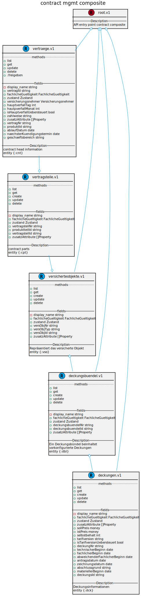

# META Spec Project *API Specification*

## Overview

### API Design Guidelines
* [Guidelines](https://cloud.google.com/apis/design/)
* [Resource Oriented Design](https://cloud.google.com/apis/design/resources)
* [Standard Methods](https://cloud.google.com/apis/design/standard_methods)
* [Custom Methods](https://cloud.google.com/apis/design/custom_methods)
* [Naming Conventions](https://cloud.google.com/apis/design/naming_convention)

### DSL to describe the API
[Restlets/Types and Response/Request definition](api/README.md)

### Objectives
* Gain insight into the API structure
* Define data content of resources
* Define meta data of fields
* Independent of implementation

## Sample Resources



---

# Getting started

## Setup

### Create a new SPEC Project

```
git clone ssh://git@git.devres.internal.adcubum.com:7999/ewf/meta-spec-restapi.git [YOUR_NAME]
```

### Generating documentation // only needed if you run it locally

> /api/docs
* swagger documentation files
* .proto files
* .go files

### Prerequisites
If you have Go installed:
```
go get github.com/veith/simple-generator
```

if not: https://golang.org/doc/install

### Installing protoc
proto-lens
API for protocol buffers using modern Haskell language and library patterns.

```
brew install protobuf
```
Alternately, run the following commands:
```
PROTOC_ZIP=protoc-3.7.1-osx-x86_64.zip
curl -OL https://github.com/google/protobuf/releases/download/v3.7.1/$PROTOC_ZIP
sudo unzip -o $PROTOC_ZIP -d /usr/local bin/protoc
rm -f $PROTOC_ZIP
```

### Installing grpc-ecosystem

```
go get github.com/grpc-ecosystem/grpc-gateway/protoc-gen-grpc-gateway
go get github.com/grpc-ecosystem/grpc-gateway/protoc-gen-swagger
go get github.com/golang/protobuf/protoc-gen-go
go get github.com/gogo/protobuf/protoc-gen-gogo
go get github.com/gogo/protobuf/protoc-gen-gogofast

```
This will place three binaries in your $GOBIN;

* protoc-gen-grpc-gateway
* protoc-gen-grpc-swagger
* protoc-gen-go

Make sure that your $GOBIN is in your $PATH.


### Running scripts
All scripts and templates are located in /scripts

```
./scripts/prepareapi.sh
./scripts/genproto.sh
./scripts/genswagger.sh
./scripts/makeEnv.js

```

or use

```
./scripts/genall.sh
```

---

## NPM Package 

registry: http://artifact.devres.internal.adcubum.com/artifactory/api/npm/npm-local/

### Publish package

You need the login credentials (.npmrc base64 decode).
* Silent login will follow
* Auto Tag will follow

```
./scripts/publishToNPM.sh
```

### Install package

This repository can be installed with the following command:

npm i @adcubum/[YOUR_NAME]